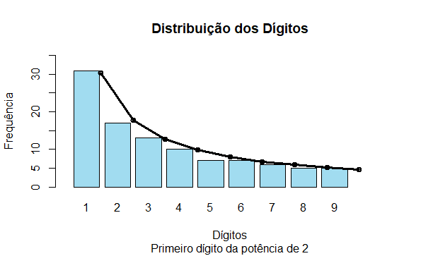
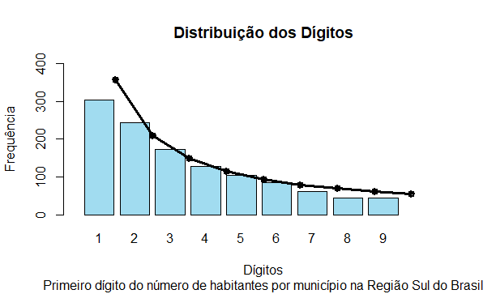
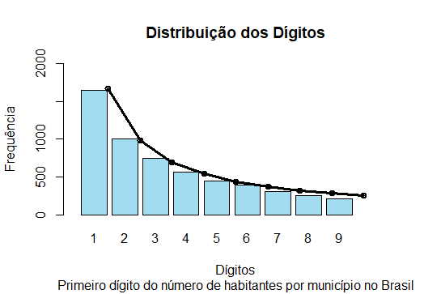

Imagine a sequência de potências de 2, agora visualize apenas o primeiro dígito de cada número, por exemplo: em 16, considere apenas o 1, em 32, apenas o 3 e assim por diante. Em qual proporção cada dígito aparece? É de se imaginar, intuitivamente, que siga uma distribuição uniforme discreta, com proporção $\frac{1}{9}$, no entanto não é isso que ocorre.

```{r echo=FALSE}
d1 <- log10(1+(1/1))
d6 <- log10(1+(1/6))
```

Em 1881, o astrônomo e matemático, Simon Newcomb, fez um questionamento parecido com este, só que com logaritmos. O astrônomo percebeu que os livros de logaritmos, de uma biblioteca pública, tinham as primeiras páginas mais “gastas” que as últimas, o que indicava que eram mais utilizadas. Intrigado com o fato, decidiu investigar mais e descobriu que em amostras aleatórios de dados reais, os números de 1 a 9 não ocupam o primeiro dígito seguindo a proporção mais intuitiva, mas que a probabilidade de um número d ser o primeiro dígito é igual a $\log_{10} (1+\frac{1}{d})$. Assim sendo, a probabilidade do primeiro dígito ser o número 1 é de `r d1` e de ser o número 6 é de `r d6`. O que pode ser percebido no nosso exercício inicial:



Neste gráfico as barras indicam a frequência que cada número ocupa o primeiro dígito e os pontos, ligados por linhas, a frequência esperada pela lei de Benford. Por se tratar de uma amostra pequena não temos a sobreposição perfeita, mas se aumentarmos a amostra a sobreposição ficará melhor. O gráfico acima foi gerado pelo seguinte código:

```{r eval=FALSE}
#Carregando package
library("openxlsx")
library(readxl)
library("benford.analysis")

#Importando a tabela que será usada
X2 <- read_excel("Pet/1 post/2 elevado a x.xlsx", 
                 col_types = c("numeric", "numeric"))
#Usaremos apenas a segunda coluna, aqui chamada de 2^x
X2x <- X2$`2^x`

#Validação segundo a lei de Benford (levará em consideração apenas os primeiros dígitos)
x <- benford(X2x, number.of.digits = 1)

#Gráfico baseado nos dados
barplot(x$bfd$data.dist.freq,
        names.arg = x$bfd$digits,
        col = "#A1DCF0",                
        main = "Distribuição dos Dígitos",
        sub = "Primeiro dígito da potência de 2",
        xlab = "Dígitos",                
        ylab = "Frequência",                   
        ylim = range(0:35),            
        xlim = range(0:10),              
        width = .8)

#Comparação com o esperado pela Lei de Benford
lines(x = x$bfd$benford.dist.freq,   
      col = "black",                     
      lwd=2,                        
      type="p") 
lines(x = x$bfd$benford.dist.freq,   
      col = "black",                     
      lwd=3,                        
      type="l") 
```

Cinquenta e sete anos mais tarde, o físico Frank Benford, chegou às mesmas conclusões de Newcomb e aplicou a teoria a uma série de documentos, que abrangiam temas variados como: a área de superfícies de rios, constantes fiscais, pesos moleculares, números em um livro matemático, tamanho de populações dos Estados Unidos, taxas de natalidade, entre outros, o que provou a existência desse padrão.

## Aplicações

A lei de Benford é utilizada principalmente para a detecção de possíveis fraudes, sua utilização em auditorias fiscais é muito famosa, mas não para por aí, outros exemplos são a utilização para verificar a autenticidade de imagens e vídeos e para descobrir possíveis bots nas redes sociais. Além disso, a lei também pode ser aplicada em músicas, esportes, tamanhos de populações, sequências numéricas (como a sequência de Fibonacci), estatísticas de crimes, taxas de câncer, tamanhos de vulcões, distâncias entre a Terra e todas as galáxias já medidas, entre muitas outras. 
  
Para melhor ilustrar, vamos visualizar a distribuição da população por município na Região Sul do Brasil e no Brasil em 2007:





Esses gráficos foram gerados de forma análoga ao anterior, um bom tutorial para a criação de gráficos como os destes, ultilizando a Lei de Benford, pode ser encontrado nesse [site](https://jtemporal.com/benford-law/), que além de elucidativo é muito divertido. 

### Referências

https://jtemporal.com/benford-law/

http://gigamatematica.blogspot.com/2011/07/lei-de-benford.html

https://www.ime.usp.br/~abe/lista/pdfr6aqDSXtbC.pdf

https://dados.gov.br/dataset/cm-contagem-da-populacao

Lei de Benford e como descobrir uma fraude fiscal.Produção de Gustavo Viegas. YouTube (https://youtu.be/KqeZUMN911Y), 2020.

Série documental "Connected: The Hidden Science of Everything", episódio 4 “Digits”, produzida pela Netflix, 2020.