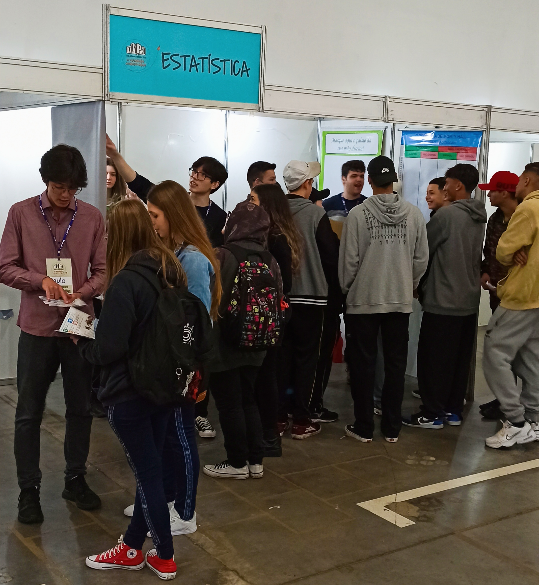
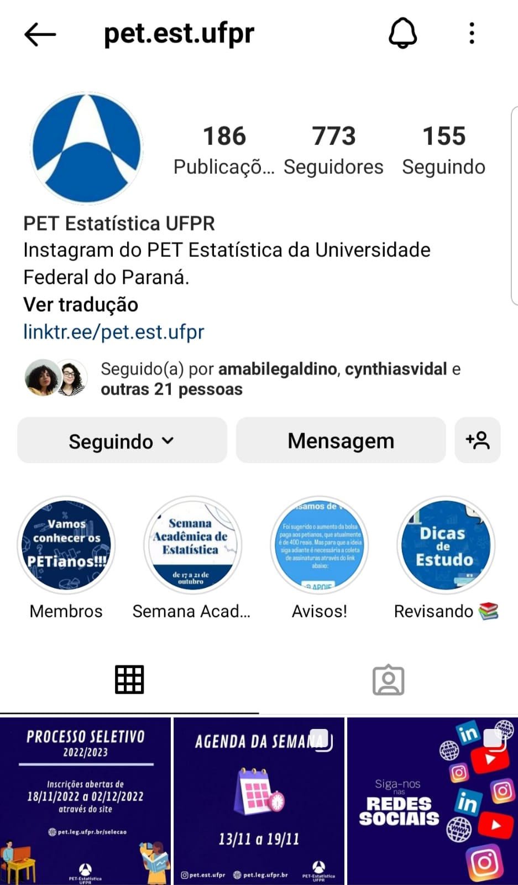
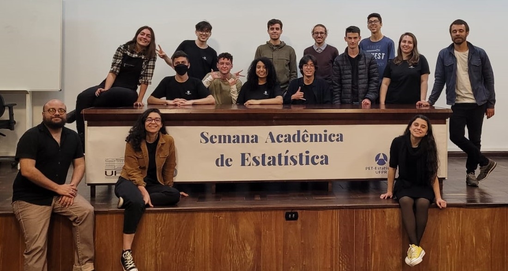

+++
title = "Projetos"
layout = "about"
description = "Confira os projetos desenvolvidos pelo PET Estatística"
date = "2020-07-16"
aliases = ["projetos"]
author = "PET Estatística UFPR"
+++

## PET Convida: disseminando o conhecimento e conhecendo trajetórias

O PET Convida é uma iniciativa do PET Estatística para promover a disseminação de ideias, tanto de Estatística, como da ciência em geral. O evento teve início em outubro de 2020 e consiste em convidar professores, pesquisadores, profissionais em geral e alunos, de todos os níveis, para exporem seus trabalhos e também falarem sobre suas carreiras, incluindo as dificuldades encontradas nessa trajetória. 

#### Objetivos

O principal objetivo é conhecer o trabalho dos mais diversos profissionais e das mais diferentes áreas, enriquecendo o conhecimento estatístico, geral e científico de todos que participam. Além disso, também visamos entender o caminho percorrido por estes profissionais.

- Fornecer aos estudantes um maior conhecimento sobre o curso;

- Mostrar a diversidade das áreas de atuação;

- Unir a comunidade de estatística;

- Auxiliar os membros do grupo PET-Estatística com sua oratória.

#### Ferramentas

O PET utilizou a versão gratuita do serviço de streaming StreamYard para realizar as transmissões em 2020. Já em 2021, o PET recebeu acesso à uma versão paga do StreamYard, fornecida pela especialização em Data Science e Big Data da UFPR, o que aumentou significativamente a qualidade das transmissões. 

#### Onde acessar

As transmissões são realizadas ao vivo às 18:00 hrs de sextas-feiras no canal do PET Estatística no [**YouTube**](https://www.youtube.com/petestatisticaufpr) e são divulgadas pelas nossas redes sociais.

Também é possível ver todas as edições pela playlist: 
[**PET Convida**](https://youtube.com/playlist?list=PLyQM-JPBi0xygjVNBLb-6DYMlG9s1bPwt).

## Feira de Cursos e Profissões

A Feira de Cursos e Profissões da UFPR ocorre anualmente, onde todos os cursos têm a oportunidade de serem apresentados para os alunos do Ensino Médio de diversas escolas do Paraná. O principal objetivo da Feira de Cursos e Profissões é apresentar a dinâmica do curso de Estatística da UFPR para os alunos do Ensino Médio que participam da Feira.

São apresentadas informações sobre o curso de Estatística aos participantes por meio de conversa com os PETianos que fazem parte do curso e que já passaram pela experiência de ter que decidir qual caminho seguir, além do uso de jogos envolvendo estatística, apresentação de painéis com exemplos de aplicações da Estatística nos mais diversos meios (esportes, pesquisas de satisfação de produtos e serviços, previsões, análises, entre outros) e a elaboração de atividades extras para serem apresentadas nos dias previstos para a Feira.

O principal resultado esperado é um aumento no número de candidatos do Vestibular da UFPR que desejem ingressar no curso de Estatística devido à Feira de Cursos e Profissões.

## Instagram do PET Estatística 

Visando o compartilhamento de conhecimento e a maior conexão, em 2021 o PET Estatística se propôs uma participação mais ativa nas redes social, em especial no [**Instagram**](https://www.instagram.com/pet.est.ufpr/) e [**LinkedIn**](https://www.linkedin.com/company/pet-estatistica-ufpr/).  

Assim, pudemos ampliar o alcance do PET Estatística e estimular o interesse da comunidade. 

Os posts podem ser agrupados em 10 categorias, de acordo com a temática, sendo elas “Site”, “Semana Acadêmica”, “Datas relevantes”, “Processo Seletivo”, “PET Convida”, “PET Ensina”, “PET Indica”, “PET Curiosidades”, “Agenda da Semana” e “PETianos".

## Semana Acadêmica de Estatistíca

A Semana Acadêmica configura-se como uma atividade de extensão, conduzida majoritariamente por meio de palestras, minicursos e mesas redondas. Tais atividades estão centradas em criar uma atmosfera para a discussão sobre a formação profissional e científica, promovendo a integração dos alunos, trocas de experiências e atualização sobre novos temas e abordagens. Entende-se que o estímulo à reflexão e a compreensão do cenário atual, e de suas tendências, permitem a identificação de problemas e oportunidades, bem como o estabelecimento de estratégias que visem solucionar demandas atuais e do futuro.

Um dos principais objetivos da semana acadêmica é complementar a formação profissional e científica com a exposição de temas contemporâneos e relevantes, contribuindo para a elevação da qualidade da formação acadêmica e profissional dos alunos de graduação. Além disso, visa compreender o atual cenário da profissão e traçar estratégias para o atendimento dos requisitos para os próximos anos da atividade. O evento também estimula a interação de profissionais e docentes de elevada qualificação técnica, científica, tecnológica e acadêmica com os alunos em formação. Ainda acarretará no aumento da visibilidade do Curso de Estatística, do Departamento de Estatística e da
Universidade na sociedade acadêmica e no meio profissional.

