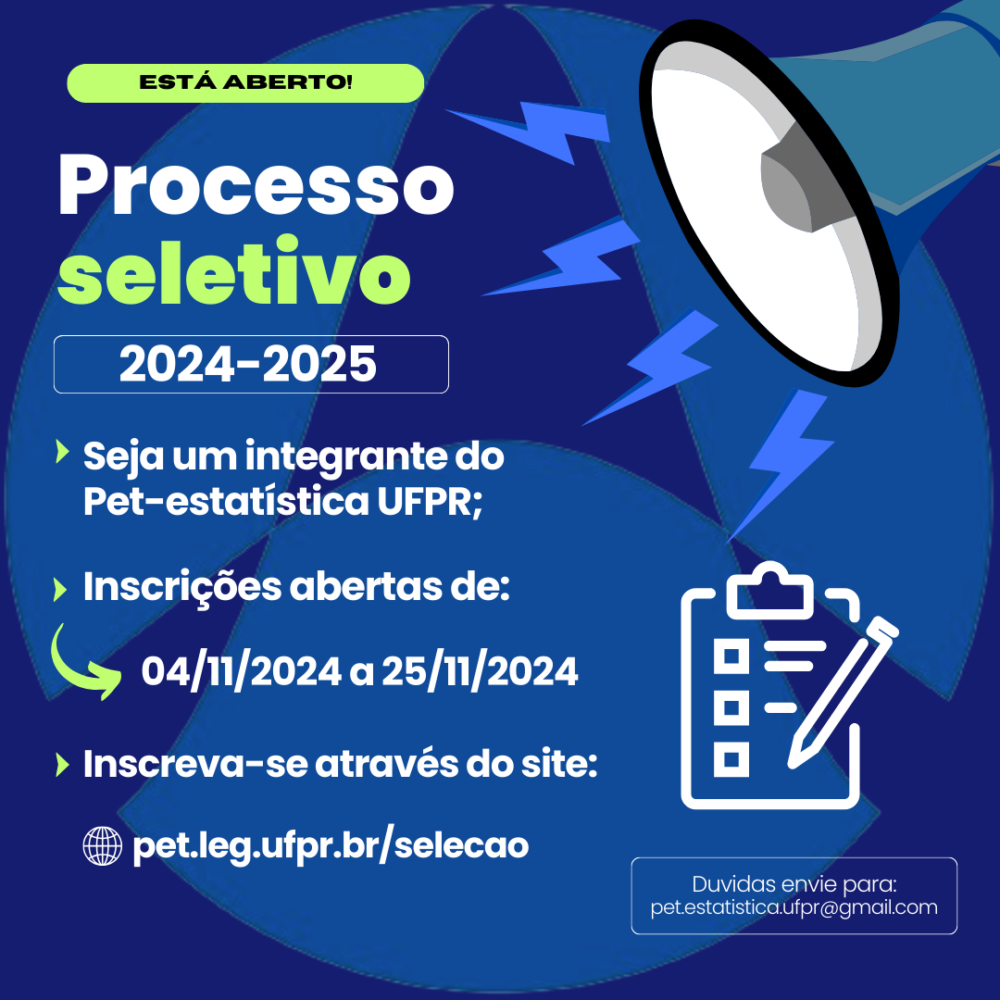

+++
title = "Processo seletivo"
layout = "about"
description = "Informações sobre o processo seletivo para o PET Estatística"
date = "2020-07-16"
aliases = ["selecao"]
author = "PET Estatística UFPR"
+++

## Processo seletivo PET Estatística 2024

Segue abaixo Comunicado Oficial sobre o  Processo Seletivo 2024 do Programa de Educação Tutorial - Estatística:

O processo seletivo do segundo semestre de 2024 do PET Estatística será presencial e ocorrerá entre **04/11/2024 e 10/12/2024** .

O período de inscrição é de **04/11/2024** até **25/11/2024**.
Neste processo serão admitidos até **4 integrantes não bolsistas** e haverá uma lista de espera para aqueles que atingirem nota superior a 60 pontos. 

Veja as principais informações abaixo, e leia atentamente o
<!--[**edital de seleção**](Edital_PET_2023_final.pdf):-->

- Período de inscrições: de **04/11/2024 à 25/11/2024**
- Realização do processo seletivo: **27/11/2024 à 29/11/2024**.
<!--
- **~~[**Edital de seleção**](Edital_PET_2023_final.pdf)~~**-->
- [**Link para inscrição**](https://forms.gle/niHaxxmeTHHieQuW8){:target="_blank"}

### Cronograma do Processo seletivo:

- **Lançamento do edital: 04/11/2024**
- **Inscrições: 04/11/2024 à 25/11/2024**
- **Resultado parcial: 26/11/2024**
- **Entrevistas: 27/11/2024 à 28/11/2024 - 19h00 às 21h00**
- **Dinâmica de trabalho em equipe: 29/11/2024 - 19h00 às 20h00**
- **Resultado Final: 10/12/2024**
<!-- - Confira o [**Resultado Parcial**](RESULTADO_E2023.pdf)!!!-->
<!-- - **Estágio probatório: 19/09/2023 à 10/10/2023**-->
<!-- - **[Resultado final](PET_PS_RESULTADOFINAL_2023.pdf): 15/10/2023**-->

<!--
=======
[**edital de seleção**](Edital_2022_2-retificado.pdf):

- Período de inscrições: de (~~**18/11/2022 à 02/12/2022**~~) **18/11/2022 à 04/12/2022**
- Realização do processo seletivo: **18/11/2022 à 13/02/2023**.
- [**Edital de seleção**](Edital_2022_2-retificado.pdf)
- [**Link para inscrição**](https://docs.google.com/forms/d/e/1FAIpQLSexZx4n4MlLCYyZaJQn1NmahJhnhU-ONpp75efHLX6zmbCkOg/viewform) 
<<<<<<< HEAD
- [Resultado Parcial](Edital_2022-Resultado_Parcial.pdf)

=======
>>>>>>> 1197baad057337f6d00b133fed3eacda9bffebe4
-->

