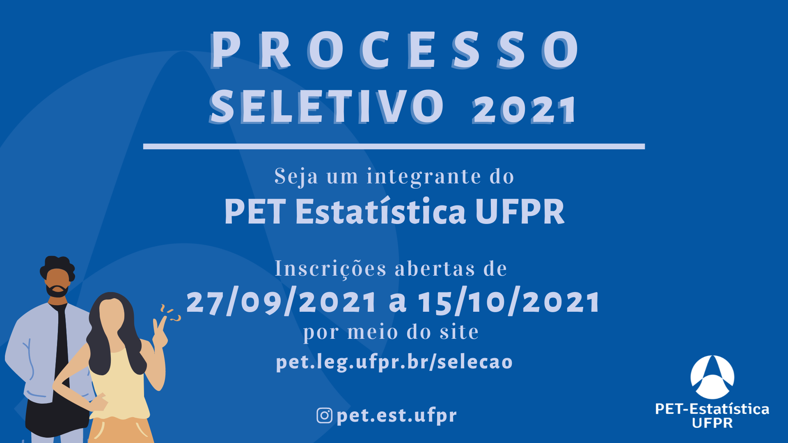

+++
title = "Processo seletivo"
layout = "about"
description = "Informações sobre o processo seletivo para o PET Estatística"
date = "2020-07-16"
aliases = ["selecao"]
author = "PET Estatística UFPR"
+++

## Informações e links para o processo seletivo 2021

{}
**ATENÇÃO: RETIFICAÇÃO DO EDITAL**

O período de inscrição foi retificado para até o dia 17/10/2021 (domingo)

O número de vagas para não bolsistas passou de 3 para 4
{}

O processo seletivo 2021 do PET Estatística será totalmente *online* e
ocorrerá entre **18/10/2021 e 28/10/2021**.

O período de inscrição é de **27/09/2021** até ~~15/10/2021~~ **17/10/2021**.
Neste ano serão admitidos **até 4 estudantes não bolsistas**. 

Veja as principais informações abaixo, e leia atentamente o 
[edital de seleção](Edital_PS_PET_Estatistica_2021.pdf):

- Período de inscrições: de **27/09/2021 a ~~15/10/2021~~ 17/10/2021**
- Realização do processo seletivo: entre **18/10/2021 e 28/10/2021**
- [Edital de seleção](Edital_PS_PET_Estatistica_2021_retificado.pdf) (**retificado em 15/10/2021**)
- [Link para inscrição](https://forms.gle/osAeqDhiVdC6fTK17)

{}
[Resultado final do Processo Seletivo 2021](Edital_2021_resultado.pdf)
{}

