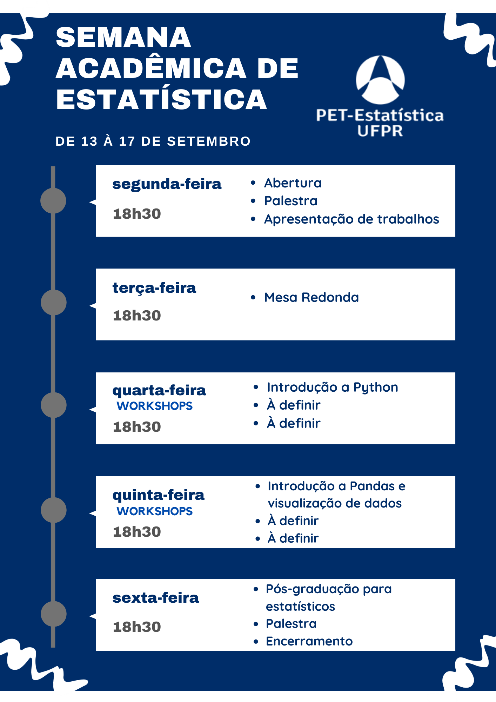
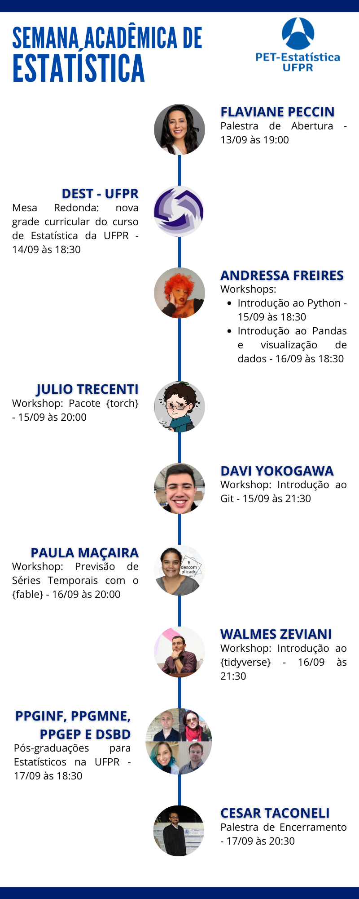

+++
title = "Semana acadêmica"
layout = "about"
description = "Semana acadêmica do curso de Estatística 2021"
date = "2020-07-13"
aliases = ["semana"]
author = "PET Estatística UFPR"
+++

 

A Semana Acadêmica configura-se como uma atividade de extensão, conduzida majoritariamente por meio de palestras, minicursos e mesas redondas. Tais atividades estão centradas em criar uma atmosfera para a discussão sobre a formação profissional e científica, promovendo a integração dos alunos, trocas de experiências e atualização sobre novos temas e abordagens. Entende-se que o estímulo à reflexão e a compreensão do cenário atual, e de suas tendências, permitem a identificação de problemas e oportunidades, bem como o estabelecimento de estratégias que visem solucionar demandas atuais e do futuro. 

- [Cronograma](#cronograma)
   - [Detalhamento das atividades](#detalhamento-das-atividades)
- [Submissão de trabalhos](#submissão-de-trabalhos)
- [Inscrições](#inscrições)
   - [Inscrição no evento](#inscrição-no-evento)
   - [Inscrição nos workshops](#inscrição-nos-workshops)
- [Datas importantes](#datas-importantes)
- [Organização e contato](#organização-e-contato)
   - [Dúvidas?](#dúvidas)

# Cronograma

## Detalhamento das atividades

<object data="crono.html" width="100%" height="750px"> 
    Your browser doesn’t support the object tag. 
</object>

 
# Submissão de trabalhos

É aluno de graduação ou pós, e tem algum trabalho acadêmico relacionado à estatística sendo desenvolvido ou já finalizado? Venha apresentá-lo na nossa semana acadêmica!

- As apresentações (*online*) serão de 15 minutos e **haverá emissão de certificado**!
- Para submeter um trabalho basta preencher o formulário abaixo com título e um resumo de no máximo 200 palavras.
- As apresentações poderão ser feitas "ao vivo" ou por meio de um vídeo enviado previamente.

[**FORMULÁRIO PARA SUBMISSÃO DE TRABALHO**](https://docs.google.com/forms/d/e/1FAIpQLSf1inxdn727ms6IojCYuaKKNFmf3iGfODlLwO8zHuF5PZpikw/viewform)

# Inscrições

## Inscrição no evento

Para se inscrever na Semana Acadêmica, preencha o formulário abaixo.

[**FORMULÁRIO DE INSCRIÇÃO NA SEMANA ACADÊMICA**](https://forms.gle/QtN681HPR9ecQfq5A)

O **certificado de participação** será emitido para quem tiver pelo menos 75% de participação no evento (haverá controle de participação *online*)

Faça parte do **grupo no WhatsApp** para receber avisos e atualizações sobre o evento (não é um grupo de discussão, as mensagens serão enviadas apenas pelos administradores). [Link para entrar no grupo](https://chat.whatsapp.com/HzOyA4DNPlwGtHnoADPHov).

## Inscrição nos workshops

As inscrições nos workshops são **gratuitas** e você pode se inscrever em quantos workshops quiser! Cada workshop terá seu prórpio **certificado de participação**.

Em breve serão disponibilizados os links para inscrição nos workshops.

- Workshop: Introdução ao Python. <a class="button-small-text" href="https://www.sympla.com.br/workshop-introducao-ao-python__1316740" target="_blank"> </img> </a>
- Workshop: Pacote {torch}. <a class="button-small-text" href="https://www.sympla.com.br/workshop-pacote-torch__1316752" target="_blank"> </img> </a> 
- Workshop: Introdução ao Github. <a class="button-small-text" href="https://www.sympla.com.br/workshop-introducao-ao-github__1316754" target="_blank"> </img> </a>
- Workshop: Introdução ao Pandas e visualização de dados. <a class="button-small-text" href="https://www.sympla.com.br/workshop-introducao-ao-pandas-e-visualizacao-de-dados__1316756" target="_blank"> </img> </a>
- Workshop: Previsão de Séries Temporais com o {fable}. <a class="button-small-text" href="https://www.sympla.com.br/workshop-previsao-de-series-temporais-com-o-fable__1316758" target="_blank"> </img> </a>
- Workshop: Introdução ao {tidyverse}. <a class="button-small-text" href="https://www.sympla.com.br/workshop-introducao-ao-tidyverse__1316760" target="_blank"> </img> </a>

# Datas importantes

<object data="prazos.html" width="100%" height="140px"> 
    Your browser doesn’t support the object tag. 
</object>

# Organização e contato

A Semana Acadêmica do curso de Estatística da UFPR é um evento organizado pelo PET Estatística, com o apoio da [Coordenação do curso de Estatística](http://www.coordest.ufpr.br/) e do [Departamento de Estatística](http://est.ufpr.br/) da UFPR, e conta com a coordenação geral das petianas

- Amábile Galdino Leandro
- Letícia Gabriele de Oliveira

### Dúvidas?

Entre em contato

- Pelo email: pet.estatistica.ufpr@gmail.com
- Pelo Instagram: [@pet.est.ufpr](https://www.instagram.com/pet.est.ufpr/)

