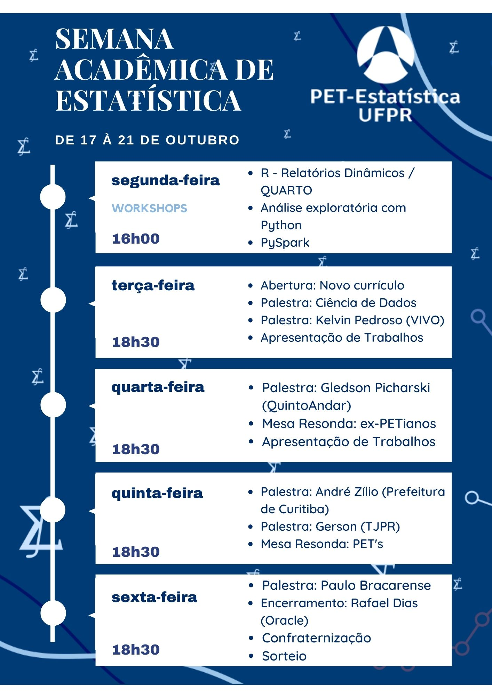

+++
title = "Semana acadêmica "
layout = "about"
description = "Semana acadêmica do curso de Estatística 2022"
date = "2020-07-13"
aliases = ["semana"]
author = "PET Estatística UFPR"
+++

<!

 

A Semana Acadêmica do Curso de Estatística é um evento organizado exclusivamente pelos integrantes do PET - Estátistica da UFPR e conta com o apoio da [Coordenação do curso de Estatística](http://www.coordest.ufpr.br/) e do [Departamento de Estatística](http://est.ufpr.br/) da Universidade. 

A Semana Acadêmica configura-se como uma atividade de extensão e tem como objetivo a divulgação do curso, da Estatística e do profissional da Estatística. Para atender esses objetivos realizaremos palestras, minicursos/workshops, apresentação de trabalhos e mesas redondas. 

As atividades estarão centradas em criar uma atmosfera para a discussão sobre a formação profissional e científica, promovendo a integração dos alunos, trocas de experiências e atualização sobre novos temas e abordagens. Entende-se que o estímulo à reflexão e a compreensão do cenário atual, e de suas tendências, permitem a identificação de problemas e oportunidades, bem como o estabelecimento de estratégias que visem solucionar demandas atuais e do futuro.

Em 2022, a Semana Acadêmica ocorrerá no formato **HÍBRIDO**, entre os dias **17 a 21 de Outubro**! Todas as atividades serão abertas ao público em geral, de forma gratuita e terá emissão de certificados. Entretanto, será necessário realizar a inscrição via formulário *online*, que em breve será disponibilizado!

O **certificado de participação** será emitido para quem tiver pelo menos 75% de participação no evento (haverá controle da frequência de participação).

As atividades presenciais acontecerão no Campus Politécnico da Universidade Federal do Paraná (UFPR), enquanto que as atividades remotas serão transmitidas no **[Canal do PET no Youtube](https://www.youtube.com/petestatisticaufpr)**.

Para não perder nenhuma novidade, siga-nos pelo [@pet.est.ufpr](https://www.instagram.com/pet.est.ufpr/)!

- [Cronograma](#cronograma)
   - [Detalhamento das atividades](#detalhamento-das-atividades)
      - [Apresentações de trabalhos](#apresentações-de-trabalhos)
- [Submissão de trabalhos](#submissão-de-trabalhos)
- [Inscrições](#inscrições)
   - [Inscrição no evento](#inscrição-no-evento)
   - [Inscrição nos workshops](#inscrição-nos-workshops)
- [Datas importantes](#datas-importantes)
- [Organização e contato](#organização-e-contato)
   - [Dúvidas?](#dúvidas)
   

 
# Cronograma

## Detalhamento das atividades

<object data="crono.html" width="100%" height="1080px">
    Your browser doesn’t support the object tag.
</object>

 
 

# Submissão de trabalhos

É aluno de graduação ou pós, e tem algum trabalho acadêmico relacionado à estatística sendo desenvolvido ou já finalizado? Venha apresentá-lo na nossa semana acadêmica!

- As apresentações (*presencial*) serão de 15 minutos e **haverá emissão de certificado**!
- Para submeter um trabalho basta preencher o formulário abaixo com título e um resumo de no máximo 200 palavras.
- As apresentações ocorrerão nos dias 18 e 19 de outubro.

[**FORMULÁRIO PARA SUBMISSÃO DE TRABALHO**](https://docs.google.com/forms/d/e/1FAIpQLSch8q2XA_ynbi21hdH-9WAvOfJXUkxuM5AVrNYWnb7wAS7xtw/viewform)

# Inscrições

## Inscrição no evento

**Em breve formulário para inscrição**

## Inscrição nos workshops

Em breve serão disponibilizados os links para inscrição nos workshops.

**Workshop:  R - Relatórios Dinâmicos / QUARTO**

Ministrante: Ariane Hayana

<!--<a class="button-small-text" href="https://www.sympla.com.br/workshop-introducao-ao-python__1316740" target="_blank"> </img> </a> -->

**Workshop: Análise exploratória em Python** 

Ministrante: Jodavid Ferreira

<!--<a class="button-small-text" href="https://www.sympla.com.br/workshop-pacote-torch__1316752" target="_blank"> </img> </a> -->

**Workshop: PySpark** 

Ministrante: Jonatas Silva do Espiríto Santos

<!--<a class="button-small-text" href="https://www.sympla.com.br/workshop-introducao-ao-github__1316754" target="_blank"> </img> </a> -->

### Apresentações de trabalhos

Em breve mais informações.

<!--
#### Segunda-feira (13/09)

- **20:15** - **Lineu Alberto Cavazani de Freitas** (*Mestrado em Informática - UFPR*)
   - Testes de hipóteses em modelos multivariados de covariância linear
     generalizada

#### Terça-feira (14/09)

- **20:45** - **Angélica Maria Tortola Ribeiro** (*Doutorado em Métodos Numéricos em Engenharia - UFPR*)
   - Modelagem de dados espaciais multivariados

# Inscrições

## Inscrição no evento

Para se inscrever na Semana Acadêmica, preencha o formulário abaixo.

 

[**FORMULÁRIO DE INSCRIÇÃO NA SEMANA ACADÊMICA**](https://forms.gle/QtN681HPR9ecQfq5A)

O **certificado de participação** será emitido para quem tiver pelo menos 75% de participação no evento (haverá controle de participação *online*)

Faça parte do **grupo no WhatsApp** para receber avisos e atualizações sobre o evento (não é um grupo de discussão, as mensagens serão enviadas apenas pelos administradores). [Link para entrar no grupo](https://chat.whatsapp.com/HzOyA4DNPlwGtHnoADPHov).

## Inscrição nos workshops

As inscrições nos workshops são **gratuitas** e você pode se inscrever em quantos workshops quiser! Cada workshop terá seu prórpio **certificado de participação**.

Em breve serão disponibilizados os links para inscrição nos workshops.

- Workshop: Introdução ao Python. <a class="button-small-text" href="https://www.sympla.com.br/workshop-introducao-ao-python__1316740" target="_blank"> </img> </a>
- Workshop: Pacote {torch}. <a class="button-small-text" href="https://www.sympla.com.br/workshop-pacote-torch__1316752" target="_blank"> </img> </a>
- Workshop: Introdução ao Github. <a class="button-small-text" href="https://www.sympla.com.br/workshop-introducao-ao-github__1316754" target="_blank"> </img> </a>

# Datas importantes

<object data="prazos.html" width="100%" height="140px">
    Your browser doesn’t support the object tag.
</object>
-->

# Organização e contato

A Semana Acadêmica do curso de Estatística da UFPR é um evento organizado pelo PET Estatística, com o apoio da [Coordenação do curso de Estatística](http://www.coordest.ufpr.br/), da [Especialização de Data Science e Big Data](http://dsbd.leg.ufpr.br/) e do [Departamento de Estatística](http://est.ufpr.br/) da UFPR.

### Gostaria de ser nosso apoiador?

Entre em contato pelos canais:

- Pelo email: pet.estatistica.ufpr@gmail.com
- Pelo Instagram: [@pet.est.ufpr](https://www.instagram.com/pet.est.ufpr/)

